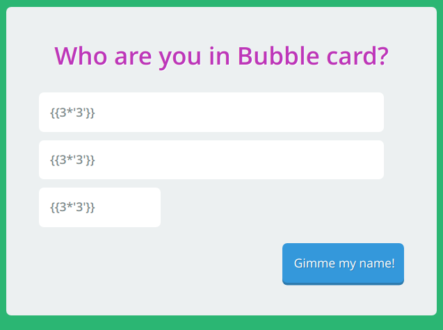
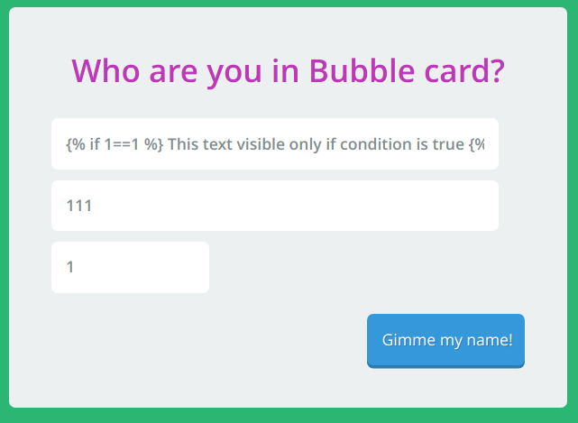

### Writeup

На главной странице задания есть возможность ввести пользовательские данные, попробуем заполнить поля и отправить их.

При отправке данных вся информация отражается пользователю.

Кроме того, при изучении хедеров в ответе сервера можно заметить, что в качестве бекенда используется python. Проведём стандартный тест на SSTI (Server Side Template Injection) для Flask:

Мы получили блокировку от сервера, что подтверждает догадки об уязвимости SSTI

В синтаксисе шиблонизатора Jinja2 (который используется в Flask-приложениях) поддержаваются альтернативные способы реализации шаблонов: для обхода блокировки попробуем использовать условное выражение ` This text visible only if condition is true ` вместо двойных брекетов `{{}}`:

Блокировка успешно обойдена.

Так как у атакующего есть лишь информация о том, верно ли выражение в брекетах или нет, у него есть возможность получить флаг посимвольным чтением, или же послать флаг на подконтрольный ему сервер, как показано в примере ниже:

` a `
